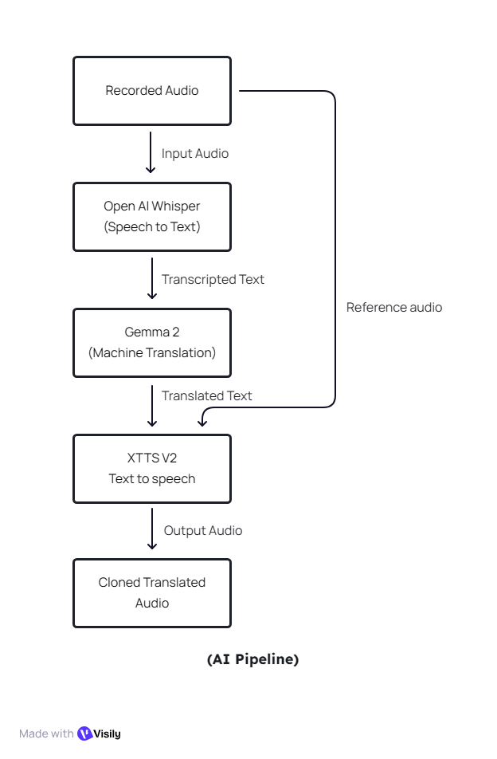
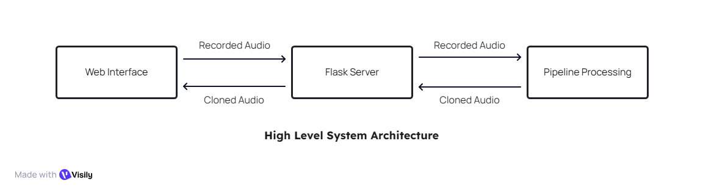
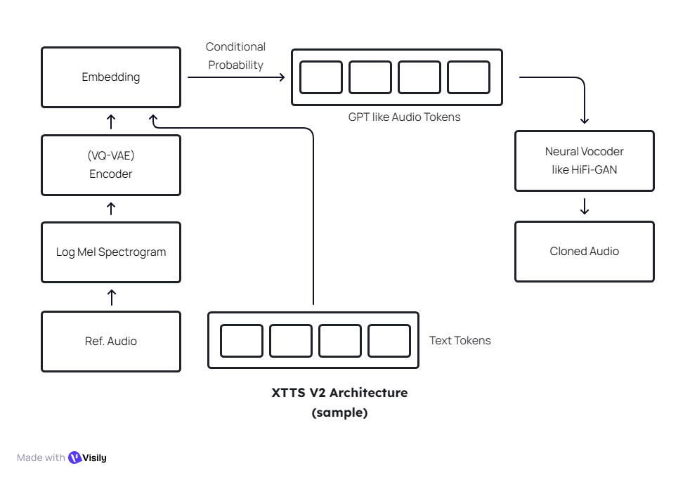
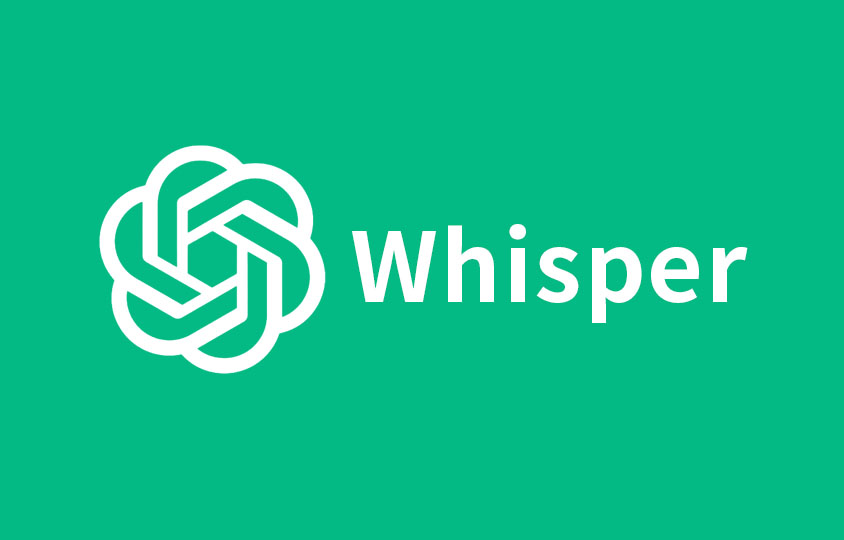
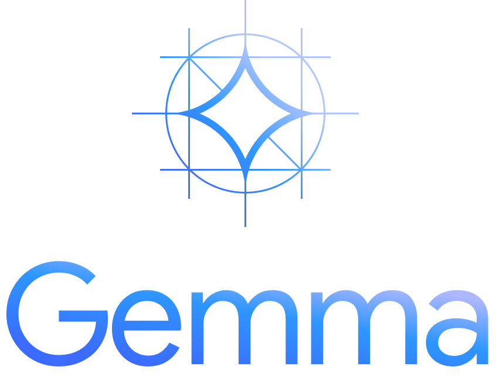

# Voice-Cloned Translator

## Overview

Voice-Cloned Translator is a sophisticated web application designed to facilitate real-time audio translation with voice cloning capabilities. The system transcribes spoken audio in one language, translates the text to a target language, and generates synthesized speech that mimics the original speaker's voice using advanced AI models.

The application leverages state-of-the-art machine learning models including OpenAI's Whisper for speech-to-text transcription, Google's Gemma2 via Ollama for natural language translation, and Coqui TTS's XTTS v2 for high-quality voice cloning and text-to-speech synthesis.

## Features

- **Real-time Audio Processing**: Record audio directly from the browser and process it instantly.
- **Multi-language Support**: Supports translation between English, Hindi, German, and Japanese.
- **Voice Cloning**: Generates speech in the target language using the original speaker's voice characteristics.
- **Web-based Interface**: User-friendly web application built with Flask and HTML/CSS.
- **Modular Architecture**: Separates transcription, translation, and synthesis into distinct pipeline stages.
- **Efficient Model Caching**: Loads and caches AI models to minimize latency for subsequent requests.

## Preview

[Listen to the audio](resource/English_translated_a1.wav)

## System Architecture

The application follows a three-stage pipeline architecture:

1. **Transcription Stage**: Audio input is processed by the Whisper model to convert speech to text.
2. **Translation Stage**: The transcribed text is translated using Gemma2 model via Ollama API.
3. **Synthesis Stage**: Translated text is converted back to speech using XTTS v2, cloning the original voice.







## Technologies Used

- **Backend Framework**: Flask (Python)
- **Speech-to-Text**: OpenAI Whisper (small model)
- **Translation**: Google Gemma2 (2B parameters) via Ollama
- **Text-to-Speech**: Coqui TTS XTTS v2
- **Audio Processing**: SciPy, NumPy
- **Frontend**: HTML, CSS, JavaScript (for audio recording)
- **Model Hosting**: Local Ollama server for translation inference

## Installation

### Prerequisites

- Python 3.8 or higher
- Ollama installed and running locally (for Gemma2 model)
- Sufficient RAM/VRAM for model loading (XTTS and Whisper require significant memory)

### Setup Steps

1. **Clone the Repository**
   ```bash
   git clone https://github.com/GoldenFish23/Voice-Cloned-Translator.git
   cd Voice-Cloned-Translator
   ```

2. **Install Python Dependencies**
   ```bash
   cd deployment
   pip install -r require.txt
   ```

3. **Install and Setup Ollama**
   - Download and install Ollama from [ollama.ai](https://ollama.ai)
   - Pull the Gemma2 model:
     ```bash
     ollama pull gemma2:2b
     ```
   - Start the Ollama server:
     ```bash
     ollama serve
     ```

4. **Download TTS Models**
   The XTTS model will be downloaded automatically on first run, but ensure internet connectivity.

## Usage

1. **Start the Application**
   ```bash
   cd deployment
   python app.py
   ```
   The application will run on `http://localhost:5000`

2. **Access the Web Interface**
   - Open a web browser and navigate to `http://localhost:5000`
   - Select source and target languages from the dropdown menus
   - Click the record button to capture audio
   - The system will process the audio and return the translated voice-cloned output

### API Endpoints

- `GET /`: Serves the main web interface
- `POST /process_audio`: Processes uploaded audio files
  - Parameters:
    - `audio`: Audio file (WAV format)
    - `src-lang`: Source language code (en, hi, de, ja)
    - `tar-lang`: Target language code (en, hi, de, ja)

## Configuration

The application uses the following default configurations:

- Whisper Model: `small` (for balanced speed and accuracy)
- Ollama URL: `http://localhost:11434/api/generate`
- Gemma2 Model: `gemma2:2b`
- TTS Model: `tts_models/multilingual/multi-dataset/xtts_v2`
- Supported Languages: English (en), Hindi (hi), German (de), Japanese (ja)

## Performance Considerations

- **Model Loading**: Initial startup may take several minutes as models are loaded into memory
- **Memory Requirements**: Ensure at least 8GB RAM for optimal performance
- **GPU Acceleration**: CUDA-compatible GPU recommended for faster inference
- **Network**: Stable internet connection required for initial model downloads

## Troubleshooting

- **Ollama Connection Issues**: Ensure Ollama server is running on port 11434
- **Model Loading Errors**: Check available disk space and memory
- **Audio Processing Failures**: Verify audio format (16kHz WAV recommended)
- **Translation Quality**: Adjust temperature parameter in Ollama settings for different creativity levels

## Contributing

Contributions are welcome! Please follow these steps:

1. Fork the repository
2. Create a feature branch
3. Make your changes
4. Test thoroughly
5. Submit a pull request

## License

This project is licensed under the MIT License - see the LICENSE file for details.

## Acknowledgments

- OpenAI for Whisper speech recognition
- Google for Gemma2 language model
- Coqui TTS for XTTS voice synthesis
- Ollama for efficient model serving

## Model Logos




